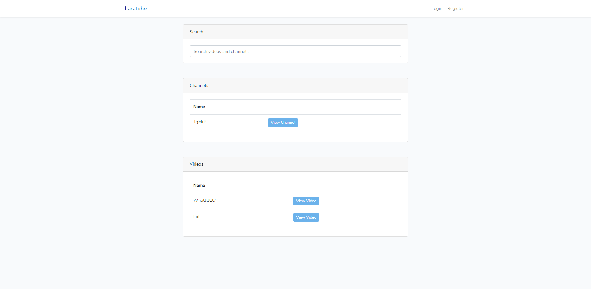
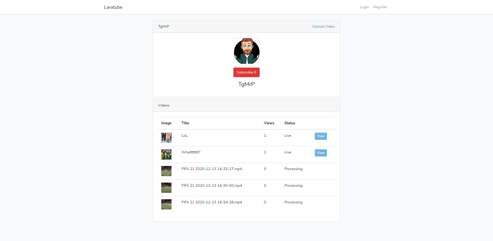
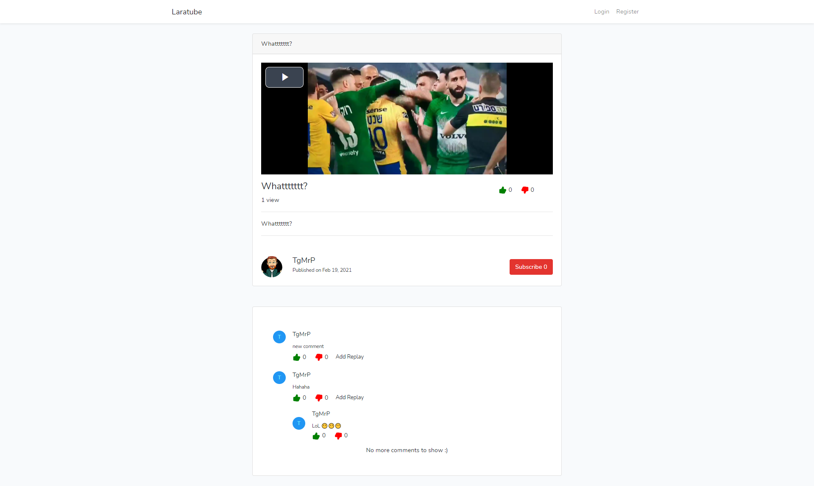
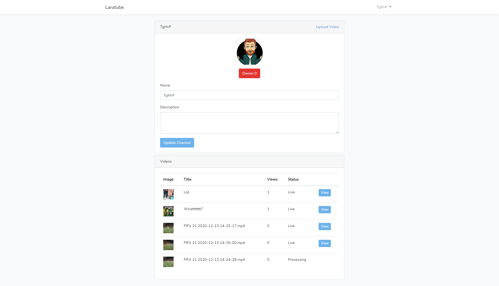
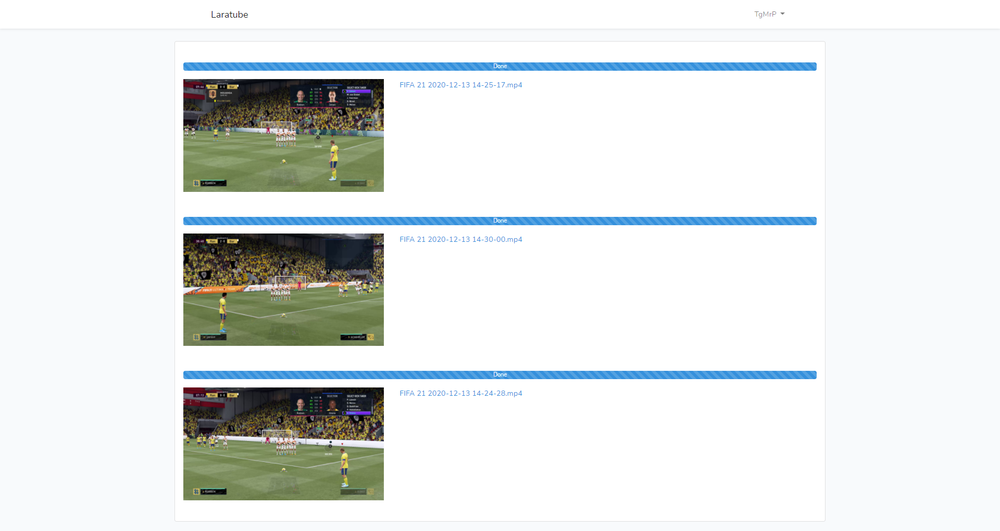
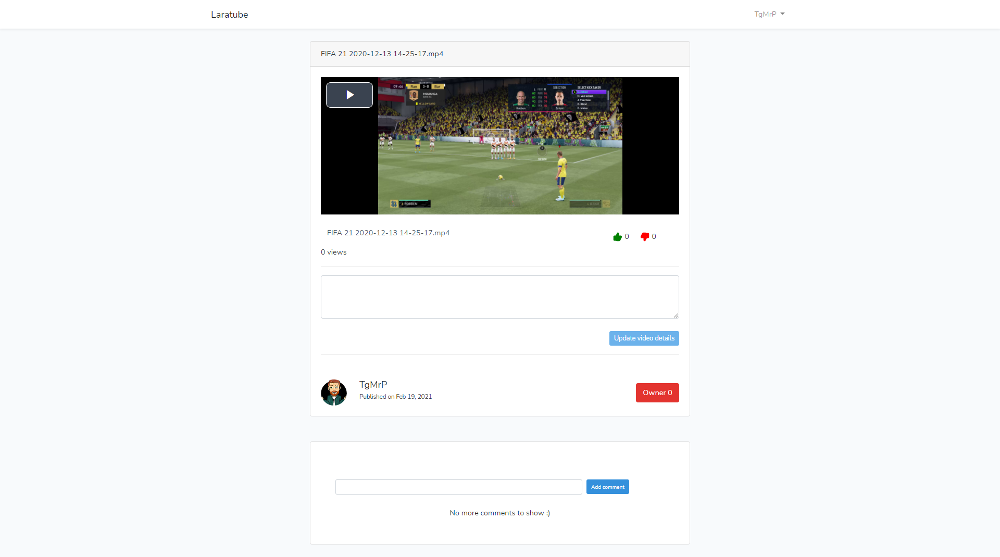

# Laratube by TgMrP

This project is a video-plattform for various scenarios.

 

## install with docker

-   [ ] change `.env.sample` to `.env`
-   [ ] run `composer install`
-   [ ] run `npm install`
-   [ ] run `docker-compose build && docker-compose up -d`

 
 

 
 

### Enjoy.
